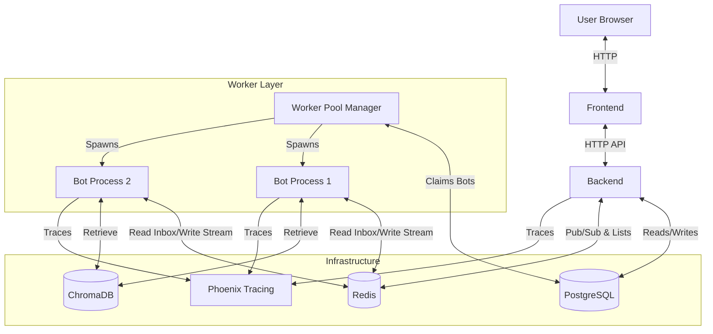
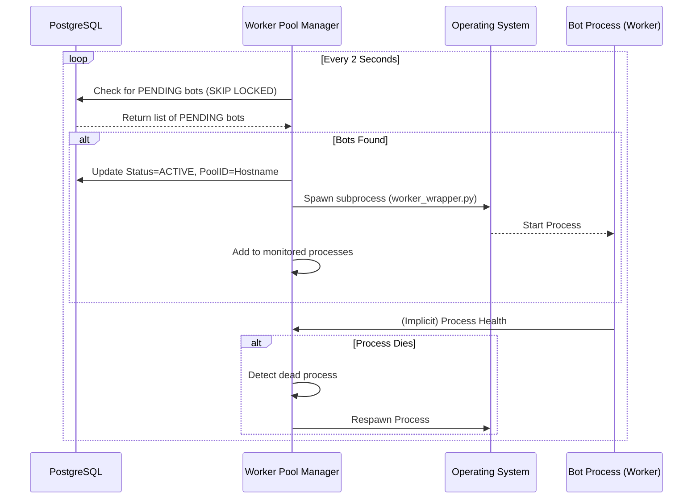
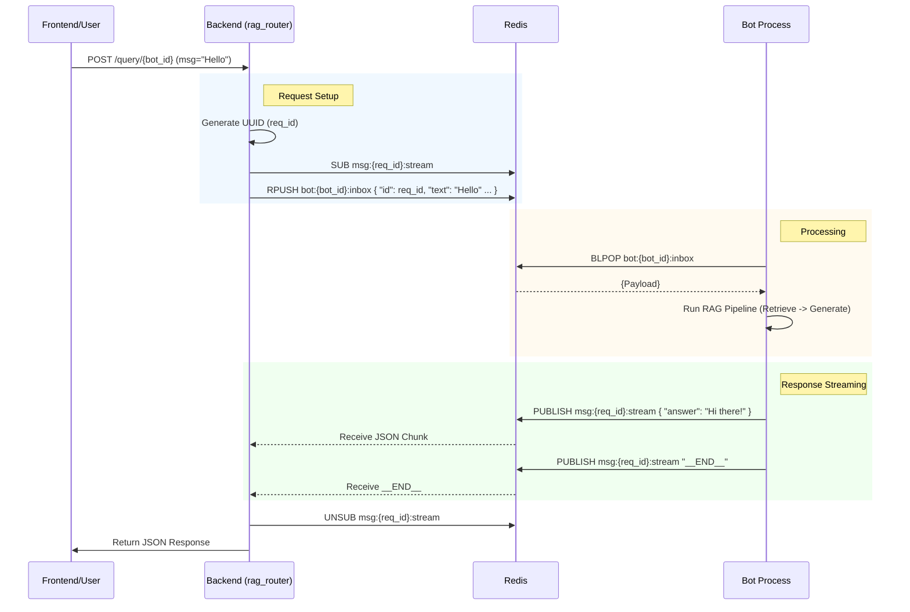

# RAG Chatbot Architecture

This document outlines the architecture of the RAG Chatbot system, focusing on the Worker Pool pattern and the asynchronous communication mechanism using Redis.

## 1. High-Level Architecture

The system is composed of several Dockerized services orchestrated via Docker Compose.

*   **Frontend**: React-based user interface (`rag_frontend`).
*   **Backend**: FastAPI application (`rag_backend`) acting as the API gateway and orchestrator.
*   **Worker Pool**: Service (`worker-pool`) responsible for managing individual Bot processes.
*   **Redis**: In-memory data store used as a message broker and for state management.
*   **PostgreSQL**: Primary relational database (`postgres`) for application data (Bots, Users, etc.).
*   **ChromaDB**: Vector database (`chromadb`) for storing embeddings.
*   **Phoenix**: Observability and tracing platform (`phoenix`).

## 2. Worker Pool Architecture

The **Worker Pool** design allows for scalable and isolated execution of RAG pipelines for different bots. It decouples the API handling (Backend) from the heavy lifting of document retrieval and LLM inference.

### Key Components

1.  **Worker Pool Service (`main.py`)**:
    *   **Role**: Manager.
    *   **Responsibility**: Monitors the database for `PENDING` bots, claims them, and spawns dedicated subprocesses (`worker_wrapper.py`) to handle them.
    *   **Health Check**: Continuously monitors child processes. If a bot process dies, it restarts it.
    *   **Orphan Cleanup**: Detects if other pools have died and releases their bots to be picked up by healthy pools.

2.  **Bot Process (`worker_wrapper.py`)**:
    *   **Role**: Worker.
    *   **Responsibility**: Dedicated to a single Bot ID. It listens to a specific Redis List (Inbox) for that bot.
    *   **Isolation**: Each bot runs in its own process, ensuring that a crash in one bot doesn't affect others or the main API.

## 3. Communication Flow (Redis)

Communication between the Backend and the Bot Workers is asynchronous and event-driven using Redis.

### Mechanism

1.  **Request Queue (Inbox)**: Each active bot has a dedicated Redis List key: `bot:{BOT_ID}:inbox`.
2.  **Response Stream (Pub/Sub)**: For each request, a unique temporary channel is created: `msg:{REQUEST_ID}:stream`.
3.  **Protocol**:
    *   Backend pushes a JSON payload to the Bot's Inbox.
    *   Backend subscribes to the Response Stream.
    *   Bot pops the message, processes it, and publishes the result to the Response Stream.
    *   Bot publishes `__END__` to signal completion.

### Sequence Diagram

## 4. Database Interaction

*   **Users/Bots**: Managed in PostgreSQL.
*   **File Records**: Seemingly managed in SQLite (`rag.db`) accessed via shared volume by both Backend and Worker Pool, OR synchronized. *Note: Current code shows usage of `rag.db` (SQLite) for file mappings in `worker_wrapper.py`, while `docker-compose` mounts a volume for it.*

## 5. Observability

*   **Phoenix**: Both Backend and Worker processes are instrumented with OpenTelemetry.
*   **Tracing**: Traces are sent to the Phoenix collector (port 6006/4317).
*   **Feedback**: Feedback from Frontend is logged to Phoenix via Backend Proxy.
