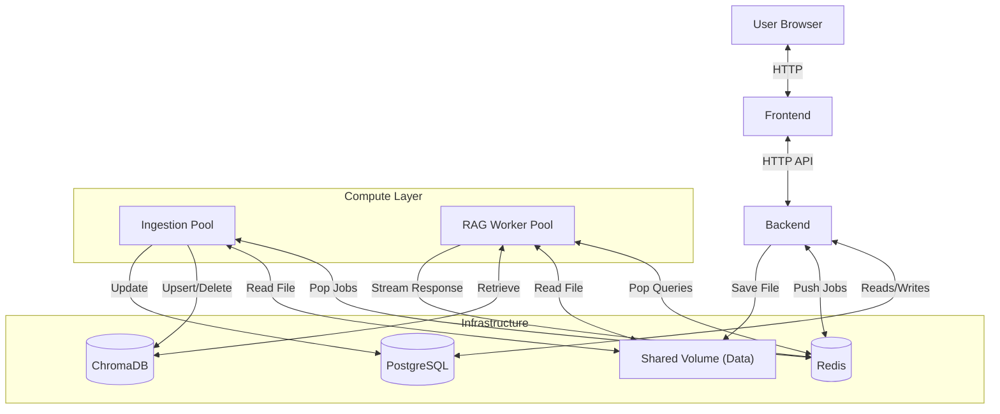
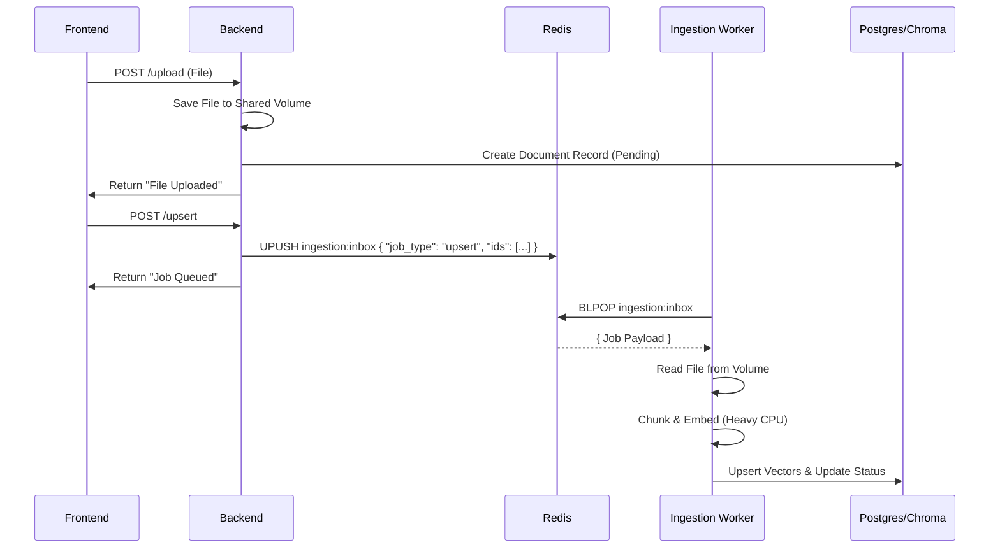

# RAG Chatbot Architecture

This document outlines the architecture of the RAG Chatbot system, focusing on the Worker Pool pattern, the independent Ingestion Pool, and the event-driven communication via Redis.

## 1. High-Level Architecture

The system is composed of decoupled microservices orchestrated via Docker Compose.

*   **Frontend**: React-based user interface (`rag_frontend`).
*   **Backend**: Lightweight FastAPI application (`rag_backend`) acting as the API gateway. It handles File I/O and metadata but delegating heavy processing to workers.
*   **Worker Pool**: Scalable service (`worker-pool`) responsible for managing Bot processes (RAG Retrieval + Generation).
*   **Ingestion Pool**: Scalable service (`ingestion-pool`) responsible for heavy file processing, chunking, embedding, and vector database updates.
*   **Redis**: Message broker used for job queues (`inbox`) and request/response streaming.
*   **PostgreSQL**: Primary relational database (`postgres`) for metadata (Bots, Files, Chunks).
*   **ChromaDB**: Vector database (`chromadb`) for storing embeddings.
*   **Shared Volume**: `rag_data` volume accessible by Backend, Worker Pool, and Ingestion Pool for file access.

## 2. Service Roles

### Backend (`rag_backend`)
The API Gateway layer.
*   **Role**: Dispatcher.
*   **Responsibilities**:
    *   File Uploads: Saves files to Shared Volume.
    *   Metadata: Creates initial records in PostgreSQL.
    *   Dispatch: Pushes "Upsert" or "Process" jobs to Redis `ingestion:inbox`.
    *   Authentication & Routing.

### Ingestion Pool (`ingestion-pool`)
The Heavy Processing layer.
*   **Role**: Consumer.
*   **Responsibilities**:
    *   Listens to `ingestion:inbox`.
    *   **Jobs Handled**: `upsert`, `process_document`, `delete_collection`, `delete_vectors`.
    *   **Logic**: Loads files via `Embeddings`/`TextSplitters` libs (PyTorch/Transformers) and updates Vector DB.
    *   **Isolation**: Keeps heavy ML libraries out of the API layer.

### Worker Pool (`worker-pool`)
The RAG Inference layer.
*   **Role**: Manager & Consumer.
*   **Responsibilities**:
    *   Manages "Bot Processes" for isolation.
    *   Listens to `bot:{id}:inbox`.
    *   **Logic**: Retrieval (Vector Search + Rerank) and Generation (LLM).

## 3. Ingestion Flow (Event-Driven)

Ingestion is entirely asynchronous. The user uploads a file, receives a "Processing" status, and the Ingestion Pool handles the rest.

## 4. RAG Query Flow

The query flow remains similar but now relies on the Shared Volume for file paths if needed (though mostly relies on Vector DB).

1.  **Request**: Backend pushes Query to `bot:{id}:inbox`.
2.  **Processing**: Worker pops Query.
3.  **Retrieval**: Worker queries ChromaDB (populated by Ingestion Pool).
4.  **Response**: Worker streams answer back via Redis Pub/Sub.

## 5. Deployment Notes

*   **Shared Volume**: Critical for decoupling. The Backend "hands off" the file via disk, and the Worker/Ingestion service picks it up.
*   **env variables**: API Keys (OpenAI, Mistral, Groq) must be provided to both pools if they perform embedding/generation.
