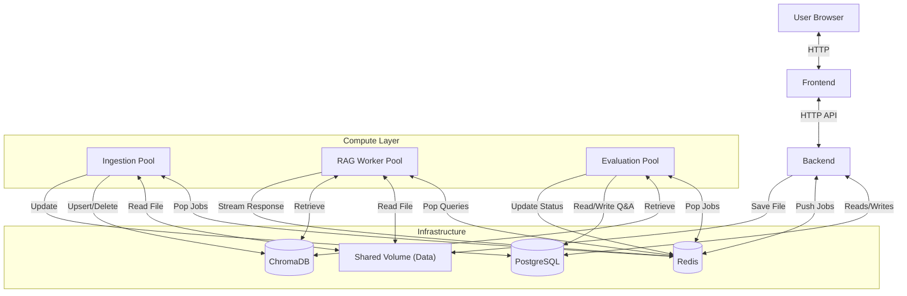
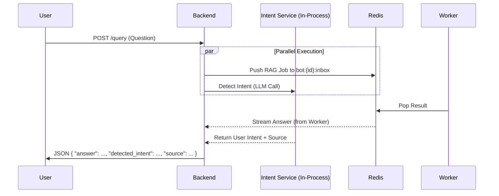
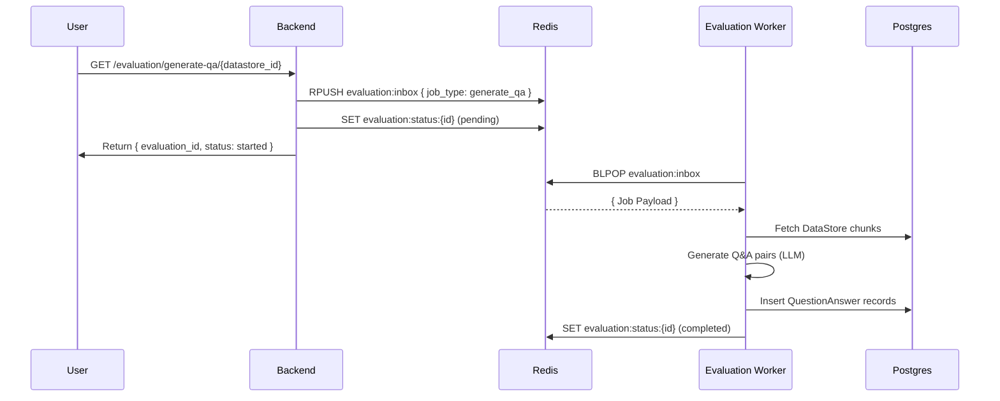
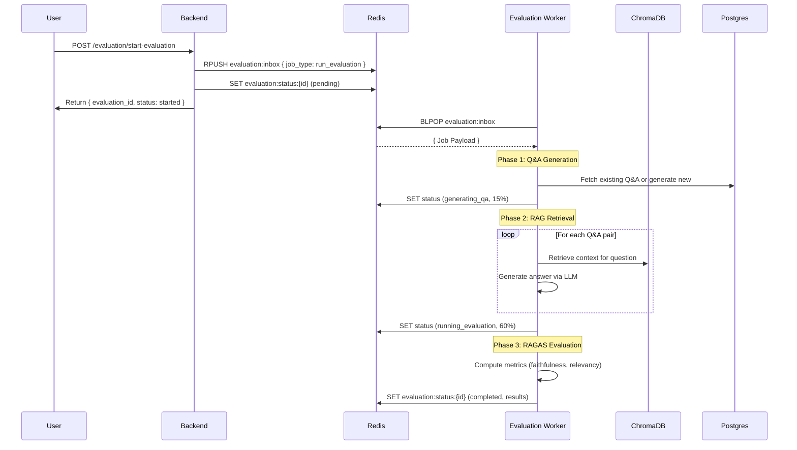

# RAG Chatbot Architecture

This document outlines the architecture of the RAG Chatbot system, focusing on the Worker Pool pattern, the independent Ingestion Pool, the Evaluation Pool, and the event-driven communication via Redis.

## 1. High-Level Architecture

The system is composed of decoupled microservices orchestrated via Docker Compose.

*   **Frontend**: React-based user interface (`rag_frontend`).
*   **Backend**: Lightweight FastAPI application (`rag_backend`) acting as the API gateway. It handles File I/O and metadata but delegating heavy processing to workers.
*   **Worker Pool**: Scalable service (`worker-pool`) responsible for managing Bot processes (RAG Retrieval + Generation).
*   **Ingestion Pool**: Scalable service (`ingestion-pool`) responsible for heavy file processing, chunking, embedding, and vector database updates.
*   **Evaluation Pool**: Scalable service (`evaluation-pool`) responsible for Q&A generation and RAG evaluation using frameworks like RAGAS.
*   **Redis**: Message broker used for job queues (`inbox`) and request/response streaming.
*   **PostgreSQL**: Primary relational database (`postgres`) for metadata (Bots, Files, Chunks, Q&A pairs).
*   **ChromaDB**: Vector database (`chromadb`) for storing embeddings.
*   **Shared Volume**: `rag_data` volume accessible by Backend, Worker Pool, Ingestion Pool, and Evaluation Pool for file access.



## 2. Service Roles

### Backend (`rag_backend`)
The API Gateway layer.
*   **Role**: Dispatcher.
*   **Responsibilities**:
    *   Metadata: Creates initial records in PostgreSQL.
    *   Dispatch: Pushes "Upsert" or "Process" jobs to Redis `ingestion:inbox`.
    *   **Intent Detection**: Runs lightweight classification (`IntentDetectionService`) in parallel with RAG requests.
    *   **Video Processing**: Handles video uploads, extracts audio using `ffmpeg` (local), and calls Mistral for transcription (synchronous).
    *   Authentication & Routing.

### Ingestion Pool (`ingestion-pool`)
The Heavy Processing layer.
*   **Role**: Consumer.
*   **Responsibilities**:
    *   Listens to `ingestion:inbox`.
    *   **Jobs Handled**: `upsert`, `process_document`, `delete_collection`, `delete_vectors`.
    *   **Logic**: Loads files via `Embeddings`/`TextSplitters` libs (PyTorch/Transformers) and updates Vector DB.
    *   **Isolation**: Keeps heavy ML libraries out of the API layer.

### Worker Pool (`worker-pool`)
The RAG Inference layer.
*   **Role**: Manager & Consumer.
*   **Responsibilities**:
    *   Manages "Bot Processes" for isolation.
    *   Listens to `bot:{id}:inbox`.
    *   **Logic**: Retrieval (Vector Search + Rerank) and Generation (LLM).

### Evaluation Pool (`evaluation-pool`)
The RAG Evaluation layer.
*   **Role**: Consumer.
*   **Responsibilities**:
    *   Listens to `evaluation:inbox`.
    *   **Jobs Handled**: `generate_qa`, `run_evaluation`.
    *   **Q&A Generation**: Uses `synthetic-data-kit` to auto-generate question-answer pairs from document chunks.
    *   **Evaluation**: Runs RAGAS framework to compute metrics like `faithfulness`, `answer_relevancy`, `context_precision`.
    *   **Status Updates**: Publishes progress to `evaluation:status:{id}` in Redis for frontend polling.
    *   **Isolation**: Keeps heavy evaluation libraries (RAGAS, LangChain) out of the API layer.

## 3. Data Model

### PostgreSQL
*   `KnowledgeAssistant`: The chatbot instance.
*   `DataStore`: The collection of documents.
*   `DocumentRecord`: File metadata.
*   `SecondarySource`: Lightweight intent-mapped files (e.g., specific PDFs for specific questions) linked to a `DataStore`.
*   `QuestionAnswer`: **[NEW]** Curated or auto-generated Q&A pairs for evaluation, linked to a `DataStore` and optionally a `DocumentRecord`.

## 4. Ingestion Flow (Event-Driven)

Ingestion is entirely asynchronous. The user uploads a file, receives a "Processing" status, and the Ingestion Pool handles the rest.

```mermaid
sequenceDiagram
    participant Client as Frontend
    participant API as Backend
    participant Redis as Redis
    participant Ingestion as Ingestion Worker
    participant DB as Postgres/Chroma

    Client->>API: POST /upload (File)
    API->>API: Save File to Shared Volume
    API->>DB: Create Document Record (Pending)
    API->>Client: Return "File Uploaded"

    Client->>API: POST /upsert
    API->>Redis: UPUSH ingestion:inbox { "job_type": "upsert", "ids": [...] }
    API->>Client: Return "Job Queued"

    Ingestion->>Redis: BLPOP ingestion:inbox
    Redis-->>Ingestion: { Job Payload }
    Ingestion->>Ingestion: Read File from Volume
    Ingestion->>Ingestion: Chunk & Embed (Heavy CPU)
    Ingestion->>DB: Upsert Vectors & Update Status

### 4.1. Video Secondary Source Ingestion (Synchronous)

Unlike the main document ingestion, Video Secondary Sources are processed synchronously within the Backend (mostly for immediate feedback/simpler flow).

1.  **Extract**: Backend uses `ffmpeg` to extract audio from the uploaded video.
2.  **Transcribe**: Backend sends audio to **Mistral API** (Voxtral) for transcription.
3.  **Analyze**: Backend uses an LLM (via LangChain) to generate an `Intent` and `Description` from the transcription.
4.  **Save**: The file is saved, and a `SecondarySource` record is created in PostgreSQL.

```mermaid
sequenceDiagram
    participant User
    participant Backend
    participant FFmpeg as FFmpeg (Os)
    participant Mistral as Mistral API
    participant LLM as Intent LLM
    participant DB as Postgres

    User->>Backend: POST /upload_video_source
    Backend->>FFmpeg: Extract Audio (.mp3)
    FFmpeg-->>Backend: Audio File
    Backend->>Mistral: Transcribe Audio
    Mistral-->>Backend: Transcript Text
    Backend->>LLM: Generate Intent & Description
    LLM-->>Backend: JSON {intent, description}
    Backend->>DB: Save SecondarySource
    Backend->>User: Return Created Source
```
```

## 5. RAG Query Flow (Parallelized)

The query flow now utilizes **parallel execution** to reduce latency. The Backend orchestrates both the heavy RAG job (via Worker) and the lightweight Intent Detection (locally).



1.  **Split**: The Backend immediately triggers two tasks using `asyncio.gather`.
2.  **Task A (RAG)**: Pushed to Redis. The **Worker Pool** picks it up, retrieves context from ChromaDB, and generates an answer.
3.  **Task B (Intent)**: The **IntentDetectionService** (in Backend) calls an LLM to classify the query against `SecondarySource` records.
4.  **Merge**: The Backend waits for both and merges the RAG answer with the detected intent/source before responding to the user.

## 6. Evaluation Flow (Event-Driven)

The Evaluation system is asynchronous, following the same pattern as ingestion. The Backend dispatches jobs to the `evaluation:inbox` queue, and the Evaluation Pool processes them independently.

### 6.1 Q&A Generation Flow



### 6.2 Full Evaluation Flow (RAGAS)



**Polling**: The Frontend polls `GET /evaluation/evaluation-status/{evaluation_id}` to track progress and retrieve final results.

## 7. Deployment Notes

*   **Detailed Dependencies**:
    *   **FFmpeg**: Required on the `Backend` container for video audio extraction.
    *   **Mistral API Key**: Required for video transcription (`voxtral-mini`) processing.
    *   **RAGAS**: Required in the `evaluation-pool` container for evaluation metrics.
*   **Shared Volume**: Critical for decoupling. The Backend "hands off" the file via disk, and the Worker/Ingestion/Evaluation services pick it up.
*   **env variables**: API Keys (OpenAI, Mistral, Groq) must be provided to all pools that perform embedding/generation/evaluation.
